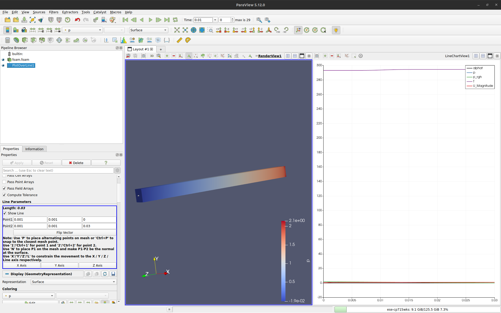

# Square channel in a solar air heater
*Day 1: Part 1.3 Tutorial - Solution*

You are expected to modify a hot Room case from OpenFOAM to model a square channel in a solar air heater device.

This folder contains the solution for two cases:
 1. squareChannelConv_T_sol: Dirichlet boundary condition for temperature
 2. squareChannelConv_Robin_constantFlux_sol: Robin boundary condition to implement constant heat flux

We encourage you to try to develop the tutorial on your own and make use of this cases as supporting material if needed.

You can use the tubeConv case we review in Part-1.2 as a reference as well.

## Set up a new case folder

Start by making a copy of the hotRoom tutorial available in "tutorials/heatTransfer/buoyantBoussinesqPimpleFoam" to this folder and change the folder name to "squareChannelConv_T".

`cp -r $FOAM_TUTORIALS/heatTransfer/buoyantBoussinesqPimpleFoam/hotRoom .`

`mv hotRoom/ squareChannelConv_T`

`cd squareChannelConv_T/`

Now your in your case folders and ready to start modifying the case.

As you progress through the case, make sure you document your changes. A simple way to do this is to add comments to the code.
For comments use  characters "//" within the OpenFOAM dictionaries and "#" within the Allrun and Allclean files, at the start of each line that you would like to comment.

## Case description
Air is heated as it flows through an square channel within a solar heater device. In a portion of the top surface of the channels, an absorber plate absorbes solar radiation and transfers the heat to the air flowing throught the square channels below. You can find [examples](https://doi.org/10.1016/j.energy.2019.116437) of similar devices in the literature. Here, we will considered a smaller channel for the purpose of this tutorial, and to decrease the computation time.

We will considered a single square channel section with a height of 2 mm, width of 2 mm an total length of 30 mm. Cool air enters the channel at a velocity of 0.5 m/s and heat up as it flows through the channel. The air is heated from the top channel wall with a constant solar power of 1300 W m $^{-2}$. It is of interest to develop a CFD model of this system to:
- Visualise the velocity and temperature profile within the channels.
- Calculate the mean temperature of the air leaving the channel as a function of time
- Estimate engineering quantities of interest for the system (e.g., Nusselt number)

## Physical model

### How is the air being heated? 
Part of the top wall of the square channel is made of an absorbent material that upon receiving solar power will tranfer the heat to the air flowing at a given velocity below this plate. This will provide a fixed heat flux of approximately 1300 W/m2 of solar power, but as a first case, we will considered setting up a case with a constant temperature $T^\star$ (Dirichlet boundary condition) at the heater surface (absorbent material) and after this we will modify the boundary condition to a constant heat flux. 

We will consider the following simplifications and assumptions:
- The energy conversion efficiency of tha absorber plate is assumed to be equal to 100%. 
- The absorber plate zone is assumed to be rectangular, covering the a centered portion of the length of the channel top wall.
- All other channel walls are insulated, and not heat flux is present.
- Tha channel 

Identify the relevant heater boundary and consider it as separately from the rest of the domain before building your geometry and mesh. 

### What would be the initial temperature?

We will assume an initial temperature of the air inside the channel will be equal to the its inlet temperature, which is of 20ºC. This will allow us to observe the transient period during which the air is heated inside the channel until i reaches a steady state temperature profile.

### What will be the domain?

To produce an accurate simulation and faster solving case, we will consider a small channel of dimension 2 x 2 x 30 mm $^{3}$. While the absorber plate has dimensions of 2 x 18 mm $^{2}$ and it is centered in the top channel wall.

For simplifation we will not considered any curvature in the channel, so we will build the geometry using rectangular cuboids and blockMesh.

### What is the temperature of the surroundings and temperature of the air at the inlet?

We will assume that the temperature of the surroundings is 27ºC. which will represent a hot summer day.

We will assume the air enters the channel at 20ºC. This is the temperature of the air when returnes to the solar heater device at a lower temperature, after being used for an agricultural process, for example.

### What is the inlet velocity of the cold air entering the square channel, and what regime do we expect?

We will considered slow velocity of 0.5 m/s. For this condition, estimate the Reynolds number, considering a density of air of 1.204 kg m $^{-3}$, a dynamic viscosity of 18.25 $\times$ 10 $^{-6}$ Pa s, and as characteristic length the hydraulic diameter of the square channel:

$$ D_h = \frac{4\times A}{P} = 0.002$$

$$ Re = \frac{\rho u_{in} D_h}{\mu} = \frac{1.204\times 0.5\times 0.002}{18.25e-6} = 65.97$$

Therefore, we are in a laminar regime.

## Numerical model

Now that you have developed the physical model, we will setup the numerical model in OpenFOAM. This will consider the conservation equation to solve for momentum, mass and energy. We will not cover the details of each one of this equations, but you can consult any book in transport phenomena for this.

We will considered two boundary conditions cases for the heater surface:

- Dirichlet condition for temperature of $T^\star = 304$ K at the heater wall, try with [fixedValue](https://www.openfoam.com/documentation/guides/latest/doc/guide-bcs-fixed-value.html)

- Robin condition: constant solar heat flux ($q$), try with [Mixed](https://www.openfoam.com/documentation/guides/latest/doc/guide-bcs-mixed.html)

$$ -\vec{n}\cdot k \frac{\partial T}{\partial y}|_{y = H} = -h (T|_{y = H} - T_\infin) - q$$

Check this [resource](https://www.cfdyna.com/Home/OpenFOAM/of_Tut_Web/of_convection-BC.pdf) for the general derivation of a convective heat transfer boundary condition with addition of a constant heat flux

### Meshing

We will use the blockMesh utility from OpenFOAM to build a simple mesh. Consider two blocks:
1. A rectangular cuboid of $2\times 2\times 30$ mm
2. A rectangular cuboid of $2\times 2\times 18$ mm

This two geometrical domains will define 3 rectangular cuboid to be added in the dictionary `blockMeshDict`. One at the entrance before the heater section, one under the heater section, and one at the outlet after the heater section. We recommend that you draw the geometry in piece of paper first, recognising the three sections and their vertices. 

Make sure to set an appropiate scale to be used to work in mm. Define all the vertices and use them to define each one of the three cuboids in `blockMeshDict`. We will use a uniform mesh with spacing of $\Delta x = 0.1$ mm, $\Delta y = 0.1$ mm and $\Delta z = 0.2$ mm. Defne the number of cells accordingly to get these cell dimensions. 

```
scale   0.001;// scales to mm 

vertices
(
    // reactangular cuboid, full channel
    (0 0 0) // 0
    (2 0 0) // 1
    (2 2 0) // 2
    (0 2 0) // 3
    (0 0 30) // 4
    (2 0 30) // 5
    (2 2 30) // 6
    (0 2 30) // 7

    // rectangular cuboid, heater section
    (0 0 6) // 8
    (2 0 6) // 9
    (2 2 6) // 10
    (0 2 6) // 11
    (0 0 24) // 12
    (2 0 24) // 13
    (2 2 24) // 14
    (0 2 24) // 15
);

blocks
(
    // Block from 0 < z < 6 mm, entrance section
    hex (0 1 2 3 8 9 10 11) (20 20 30) simpleGrading (1 1 1)

    // Block from 6 < z < 24 mm, heater section
    hex (8 9 10 11 12 13 14 15) (20 20 90) simpleGrading (1 1 1)

    // Block from 24 < z < 30 mm, outlet section    
    hex (12 13 14 15 4 5 6 7) (20 20 30) simpleGrading (1 1 1)
);
```

Define all channel boundaries using `patch` for the inlet and outlet and `wall` for all other boundaries.

```
boundary
(
    inlet
    {
        type patch;
        faces
        (
            (0 1 2 3)
        );
    }
    
    outlet
    {
        type patch;
        faces
        (
            (4 5 6 7)
        );
    }

    bottom
    {
        type wall;
        faces
        (
            (0 1 9 8)
            (8 9 13 12)
            (12 13 5 4)
        );
    }

    heater
    {
        type wall;
        faces
        (
            (11 10 14 15)
        );
    }

    top
    {
        type wall;
        faces
        (
            (3 2 10 11)
            (15 14 6 7)
        );
    }

    front
    {
        type wall;
        faces
        (
            (1 9 10 2)
            (9 13 14 10)
            (13 5 6 14)
        );
    }

    back
    {
        type wall;
        faces
        (
            (0 8 11 3)
            (8 12 15 11)
            (12 4 7 15)
        );
    }
);
```

You can the [blockMesh](https://www.openfoam.com/documentation/user-guide/4-mesh-generation-and-conversion/4.3-mesh-generation-with-the-blockmesh-utility) utility documentation in te OpenFOAM website.

### 0 Directory

Since our simulation uses a laminar flow regime. We only need to set up initial and boundary conditions for:
- p: set the pressure internalField equal to zero, p = 0 m $^2$ s $^{-2}$ (pressure over density for incompressible case), and leave all other boundary conditions as calculated.
```
internalField   uniform 0;

boundaryField
{
    inlet
    {
        type            calculated;
        value           $internalField;
    }

    outlet
    {
        type            calculated;
        value           $internalField;
    }

    bottom
    {
        type            calculated;
        value           $internalField;
    }

    heater
    {
        type            calculated;
        value           $internalField;
    }

    top
    {
        type            calculated;
        value           $internalField;
    }

    front
    {
        type            calculated;
        value           $internalField;
    }

    back
    {
        type            calculated;
        value           $internalField;
    }
}
```
- p_rgh: set the pressure minus the hydrostatic head to internalField equal to zero, p = 0 m $^2$ s $^{-2}$. Set the boundary conditions to:
    - inlet: as fixedFluxPressure with a gradient and value equal to zero.
    - outlet: set to a fixedValue of zero.
    - Other walls: set to fixedFluxPressure to be calculate based on the velocity boundary condition.
```
internalField   uniform 0;

boundaryField
{
    inlet
    {
        type            fixedFluxPressure;
        gradient        uniform 0;
        value           uniform 0;
    }

    outlet
    {
        type            fixedValue;
        value           uniform 0;
    }

    bottom
    {
        type            fixedFluxPressure;
    }

    heater
    {
        type            fixedFluxPressure;
    }

    top
    {
        type            fixedFluxPressure;
    }

    front
    {
        type            fixedFluxPressure;
    }

    back
    {
        type            fixedFluxPressure;
    }
}
```

- T: set the internal field (initial condition) to 293 K, which is equivalent to 20ºC. For the boundaries we will consider:
    - inlet: set the temperature to 293 K
    - outlet and insulated walls: use a zeroGradient boundary condition. In the case of inslated walls this means that no heat flux is present, and in the case of the outlet this means and open boundary.
    - heater: for the absorber plate we will considered two cases:
        - case 1, Dirichlet: Set the heater wall to a fixedValue of 304 K
        ```
        internalField   uniform 293;

        boundaryField
        {
            inlet
            {
                type            fixedValue;
                value           uniform 293;
            }
            outlet
            {
                type            zeroGradient;
            }
            bottom
            {
                type            zeroGradient;
            }
            heater
            {
                type            fixedValue;
                value           uniform 304;
            }
            top
            {
                type            zeroGradient;
            }
            front
            {
                type            zeroGradient;
            }
            back
            {
                type            zeroGradient;
            }
        }
        ```
        - case 2, Robin: Set the heater wall to a mixed boundary condition and set the values for the refValue as the surrundings temperature (300 K), the refGradient as $q/k$ and the valueFraction as $f = 1 / (1 + k/(h \delta))$
        ```
        internalField   uniform 293;

        boundaryField
        {
            inlet
            {
                type            fixedValue;
                value           uniform 293;
            }
            outlet
            {
                type            zeroGradient;
            }
            bottom
            {
                type            zeroGradient;
            }
            heater
            {
                type            mixed;

                // reference value: surrounding temperature
                refValue        uniform 300;

                // reference gradient = q/k = 1300 [W/m2] / 0.02514 [W/m/K]
                refGradient     uniform 51710;

                // Approximtion using a turbulent thermal conductivity of 0.0071 W/mK
                // f = 1/(1+k_total/delta/h), but in laminar regime k_total ~ k
                // delta: half of face-center to cell-center distance [m]
                // h: heat transfer coefficient [W/m2-K] for convective heat transfer from the surroundings to the wall
                valueFraction   uniform 0.3321;
            }
            top
            {
                type            zeroGradient;
            }
            front
            {
                type            zeroGradient;
            }
            back
            {
                type            zeroGradient;
            }
        }
        ```
- U: set the internal field (initial condition) to 0.5 m s $^{-1}$. For the boundaries we will consider:
    - inlet: set the velocity to a fixedValue of 0.5 m s $^{-1}$.
    - outlet: consider it as open flow with zeroGradient.
    - other boundaries: set all other channels walls as as noSlip.
```
internalField   uniform (0 0 0.5);

boundaryField
{
    inlet
    {
        // fixed uniform fluid velocity at the inlet of 0.1 m/s
        type            fixedValue;
        value           uniform (0 0 0.5);
    }

    outlet
    {
        // open flow at outlet which is given by a zero velocity gradient
        type            zeroGradient;
    }

    bottom
    {
        // 
        type            noSlip;
    }

    heater
    {
        type            noSlip;
    }

    top
    {
        type            noSlip;
    }

    front
    {
        type            noSlip;
    }

    back
    {
        type            noSlip;
    }
}
```

### constant

#### g 

Make sure the gravity value is correct and is pointing downwards in the $y$-coordinate
```
dimensions      [0 1 -2 0 0 0 0];
value           (0 -9.81 0);
```
#### transportProperties
We will use a incompressible Newtonian viscosity model.
Modify the properties to use the values for air

```
transportModel Newtonian;

// Laminar viscosity of air / Pa * s
nu              15.16e-6; 

// Thermal expansion coefficient / 1/K
beta            3e-3; 

// Reference temperature
TRef            293; 

// Laminar Prandtl number
Pr              0.73;

// Turbulent Prandtl number
Prt             0.85;

// Additional parameters

// Thermal conductivity / W/m/K
k               0.02514;

// Convection coefficient / W / m^2 / K 
h               25;   

```

#### turbulenceProperties
Modify the dictionary to cnsider a laminar case

```
simulationType laminar;
```
### system

#### controlDict
We will run the simulation for 0.3 s saving results each 0.01 s. Start with a
small time step of 1e-7 s and allow for a adjustTimeStep and a maxCo of 0.75.

```
application     buoyantBoussinesqPimpleFoam;

startFrom       latestTime;

startTime       0;

stopAt          endTime;

endTime         3e-1;

deltaT          1e-7;

writeControl    adjustableRunTime;

writeInterval   1e-2;

purgeWrite      0;

writeFormat     ascii;

writePrecision  6;

writeCompression off;

timeFormat      general;

timePrecision   6;

runTimeModifiable true;

adjustTimeStep  yes;

maxCo           0.75;
```

### fvSchemes and fvSolution
We will keep the same settings that we used in our previous example `tubeConv`. Copy the `fvSchemes` and `fvSolution` form that case to the system folder

#### decomposePar

```
numberOfSubdomains 4;

method          simple;

coeffs
{
    n           (1 1 4);
}
```

### Allclean
Check the `Allclean` so that it deldetes time folder and processor folders

```
# Remove time folders, but not the 0 folder
rm -r [0-9].*
rm -r [1-9]*

# remove processor folders
rm -r proc*

# Remove log files
rm log.*
````

### Allrun
Modify the `Allrun` to run in parallel in 4 processors

```
# Create mesh
runApplication blockMesh | tee -a log.blockMesh

# Decompose mesh in n number of processors
decomposePar | tee -a log.decomposePar

# Run solver either in single procesor or in n processors in parallel 
# runApplication $(getApplication) # Use this line instead to run in sigle processor
mpirun -np 4 $(getApplication) -parallel | tee -a log.buoyantBoussinesqPimpleFoam

# Reconstruct solution (decomposed solution can also be load in paraview)
reconstructPar -constant | tee -a log.resconstructPar

# Remove processor folders (if you reconstruct thesolution, no need to keep them)
rm -rf proc*
```

## Post-processing with Paraview

### Plot over line for temperature and velocity profiles along the $z$-coordinate

If you have not yet, create a dummy file in your case folder:

`touch foam.foam`

Launch ParaView and load foam.foam:

`paraview foam.foam`

After you launch ParaView, you will not see any geometry. Click on "Apply" on the left panel to see the square channel:


To add a `PlotOverLine` you can either do right click on `foam.foam` in the "Pipeline Browser", then select "Add Filter" and then select "PlotOverLine".

Another option is to use the shortcut `Ctrl + tab` which launches a window where you can look for "Plot Over Line" and then hit "Enter".

On the left panel "Properties" scroll down to "Line Parameters" and set the first and final points of a line through the center of the channel:
- Point 1: (0.001, 0.001, 0)
- Point 2: (0.001, 0.001, 0.03)

Clink "Apply" and a second window will appear with several line plots, this is initially displaying all of the variables along the $z$-coordinate:



Click on top of the line plot to activate this layout, and on the left panel "Properties", scroll down to "Series Parameters", select and de-select all of the variables first. Then only select "T" and you will see the the line temperature plot.

Click on the "Layout #1" window that is displaying the channel in 3-D and select from the variables on the top menu, "T".

Use the "First frame" button [|<] on the top menu to go to the first time, and both windows will display the 3D temperature profile and the 1D line plot at 0.005 s.

Then use the play button [>] to visualise the transient temperature profile.For the case with constant wall temperature you should see:


Modify the variables selected in both "Layout #1" to "U" and in the line plot to "U_Magnitude" to visualize the velocity profile along the center of the channel.

Since we considered a nonSlip boundary condition in all channel walls, we can use a `Clip` to cut through the middle and observe the velocity profile. 

First, click the `foam.foam` in the "Pipeline Browser". Then use `Ctrl + tab` and type "Clip", then hit Enter to slect a `Clip` filter. In the left panel "Properties" scroll down to "Plane Parameters" and select `X Normal`, deselect "Show Plane" and click "Apply".

The profile that is shown is the pressure. Choose from the top menu variables "U" to see the velocity profile.


Velocity profile at 5e-3 s:


Velocity profile at 0.3 s:


You can repeat the same steps for the second simulation case that uses a constant power solar flux in the heater surface.

It is also possible to compare side-by-side both simulation results by loading the two `foam.foam` files into ParaView. and using the filter `Transform` in one of them to translate it by -0.005 in the $y$-coordinate. Then you can compare the 3-D profiles and plot over lines, for example for the temperature of through the middle of the top channel wall:


### Mean outlet temperature over time

To do this we will use again the filter `Clip`. 

Add this filter to the `foam.foam` and select `Z Normal`. Then modify the Origin to (0.001, 0.001, 0.0299) and deselect "Show Plane" in the "Plane Parameters".

Below the "Plane Parameters" in the left panel, deselect "Invert"

Cick "Apply" and on the top menu slect "Surface with Edges" and click the icon "Rescale to Visible Data Range". You should see a single cell cross-sectional area of the channel: 


Select `Clip1` on the "Pipeline Browser", and add filter `IntegrateVariables`. On the left panel, select "Divide Cell Data By Volume" and clip "Apply".

A new window will appear displaying a row with the integrated values. In the top menu of this windows in "Attribute" select "Cell data"

Then select "IntegrateVariables1" on the "Pipeline Browser", and add the filter `Plot Data Over Time`. On the left panel select "Cells" for "Field Association" and click "Apply". An Additional widow will appear, initially showing all intrgrated variable values over time.

Scroll down to the "Series Parameters" section, select and deselct all variables, and then select "T (stats)":


### Calculate the mean Nusselt number 

To calculate the engineering quantity of interest, the Nusselt number, which gives the ratio between the total heat transfer (convection + conduction) to conductive heat transfer, we can consider:

$$ Nu = \frac{h D_h}{k}$$

$$ h (T - T_w) = - k \frac{\partial T}{\partial n}|_w$$

$$ T = \frac{\int_A T u_z dA}{\int_A u_x dA}$$

$$ Nu = \frac{h D_h}{k} = -\frac{\frac{\partial T}{\partial n}|_w}{(T(z) - T_w)/D_h}$$

Therefore we need to evaluate the the mean temperature of the air $T$, the wall temperature $T_w$, and the temperature gradient at the wall $\frac{\partial T}{\partial n}|_w$. We will use ParaView.

Load the case for with a constant heat flux on the heater into ParaView.


Mean temperature = 176.231 / 0.5957 = 295.85 K

Wall temperature = 302 K

Mean wall gradient = 5963.39 K/m

$$ Nu = \frac{-5963.39}{(295.85-302)\times 0.002} \approx 1.94$$

Typical values for laminar flows range between 1 and 10.

With the geometry and conditions used here (for the purpose of a fast simulation test case) we get a small contribution due to convection while most of the heat is transfered by conduction. Modification to the top wall where the absorbent material is could be considered to increase tubulence in the region and increase the Nu number, for example.


